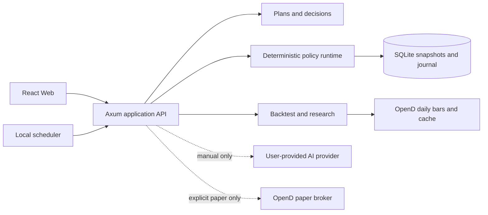

<p align="center">
  
</p>

<p align="center">
  <strong>Turn a long-term investing method into an understandable, testable and auditable personal plan.</strong>
</p>

<p align="center">
  <a href="./readme.md">中文文档</a> · English
</p>

<p align="center">
  <a href="./LICENSE"></a>
  <a href="./CHANGE_LOG.md"></a>
  <a href="./SECURITY.md"></a>
</p>

# IndexLink V2.1

IndexLink is a **local strategy-planning and research tool for long-term investors**. It turns an investing method into explainable rules, real historical backtests, periodic suggestions, and append-only execution records.

V2.1 is single-user, local-first, and manually executed. It does not place live orders, promise returns, or grant an AI model trading authority.

> **Risk notice:** This project is for education, strategy research, and paper-trading demonstrations only. It is not investment advice. Historical backtests do not predict future results.

## What works today

| Area | Current capability | Boundary |
| --- | --- | --- |
| Personal | Reads real plans, the current suggestion, next evaluation date, and append-only execution history | No automatic orders; one due decision can receive only one final confirmation |
| Plans | Creates, pauses, resumes, and deletes long-term plans; freezes the policy version, instrument, budget, and evaluation cadence | Fixed DCA works without market data; formula plans require a history preflight |
| Strategy Center | One Fixed DCA baseline plus 20 rule families with five immutable parameter sets each: 101 official versions in total | Availability is not suitability or a performance claim |
| Strategy Workshop | Builds personal policies from allowlisted indicators, windows, comparisons, thresholds, and opportunity allocations | No arbitrary code; at most three priority rules and three conditions per rule |
| Strategy Analysis | Runs real daily-bar backtests for user-selected US/HK/SH/SZ instruments over 1m/3m/6m/1y/3y/5y/all | Every comparison shares the same instrument, dates, cash flow, and cost assumptions; missing data fails explicitly |
| Advanced Lab | Temporarily connects a local Futu/Moomoo OpenD and user-provided QwenCloud, DashScope, GPT, Claude, or DeepSeek credentials | Credentials live only in the current Rust process; Lab OpenD access is read-only market data |
| Optional AI | Manually runs natural-language-to-bounded-draft, backtest explanation, and recent-plan summary | AI does not calculate returns, save or activate policies, create orders, or run automatically |

## The local workflow

```text
Strategy Center / Workshop
        → real-instrument backtest and data preflight
        → create a personal plan
        → scheduler idempotently creates a due suggestion
        → the user trades in their own broker
        → manually record executed or skipped
        → keep immutable evidence and execution history
```

“Execution” normally means a user-reported fact. The optional OpenD paper broker is an explicit local experiment only; neither the scheduler nor AI can submit orders automatically.

## Policy and backtest model

The catalog is not a collection of unrelated scripts. Official and personal formula policies share a bounded, immutable model:

```text
historical daily bars
  → causal indicators using observations available at the evaluation date
  → first matching priority rule
  → adjust only the opportunity allocation
  → preserve the core contribution
```

The allowlist covers price/index moving averages, dual and triple moving averages, RSI, historical price percentile, volatility and volatility expansion, drawdown, proximity to highs, and several trend/momentum/volatility combinations. Fixed DCA remains the mandatory baseline.

Backtests use the same instrument, date window, contribution schedule, execution-day mapping, and cost model for every selected policy. The normalized wealth chart starts all paths at `100`; it is neither the stock price nor an account balance. Professional results include total and annualized return, XIRR, maximum drawdown, annualized volatility, Sortino, cash utilization, transaction costs, drawdown dates, ledger details, and substituted formula values.

Warm-up shortages, stale or unavailable data, and provider permission failures are explicit errors. The application does not replace missing data with demo curves.

## Run locally

Requirements: stable Rust, Node.js, and pnpm. Futu/Moomoo OpenD is optional and is needed for new real-data US/HK/SH/SZ backtests.

```bash
git clone https://github.com/GuZZ1119/indexlinkV2.git
cd indexlinkV2
cp .env.example .env
cargo run -p indexlink-server
```

The API binds to `127.0.0.1:8080` by default:

```bash
curl http://127.0.0.1:8080/health
curl http://127.0.0.1:8080/ready
```

Start the web application in another terminal:

```bash
pnpm --dir apps/web install --frozen-lockfile
pnpm --dir apps/web dev
```

Open the local Vite URL, usually `http://127.0.0.1:5173`.

### Optional OpenD market data

Start and sign in to Futu/Moomoo OpenD, then configure it from Advanced Lab or a local, ignored `.env`:

```dotenv
OPEND_PROVIDER=moomoo
OPEND_HOST=127.0.0.1
OPEND_PORT=11111
OPEND_MARKET_DATA_ENABLED=true
OPEND_PAPER_BROKER_ENABLED=false
```

Without OpenD, plan management, Fixed DCA, the manual execution journal, and bundled research remain usable. New arbitrary-instrument backtests and market-dependent formula policies fail with a clear data-unavailable state.

### Optional user-provided AI

Select a provider and model in Advanced Lab, enter a key, and click the availability test. The key is sent only to the local backend process and is not written to browser storage, SQLite, `.env`, or logs. Saving a connection does not invoke the model; every AI action is manually triggered.

### Optional local Docker

```bash
docker compose -f deployment/docker-compose.yml up --build
```

Compose publishes the API on host loopback only. This repository no longer ships cloud-server deployment scripts. Before exposing the API remotely, add authentication, TLS, rate limits, and CSRF/Origin protections.

## Security model

- The server and Docker bind/publish to loopback by default. The current API has **no account authentication** and must not be exposed to a LAN or the public internet.
- HTTP request and RSS response bodies are bounded to 1 MiB; parser failures do not log raw model output.
- Provider endpoints are server-controlled, remote endpoints require HTTPS, and API keys are never echoed.
- OpenD must use a loopback address; a Lab session does not grant paper-broker authority.
- Domain newtypes, policy documents, immutable versions, and execution records are revalidated server-side.
- Policy runtime code cannot execute user scripts or directly reach the network, database, or broker.

Read [SECURITY.md](./SECURITY.md) for the threat model and remaining dependency advisories, and the [V2.1 code audit](./docs/reviews/v2_1_code_audit_2026-09-23.md) for the closeout evidence.

## Architecture

IndexLink uses **Hexagonal Architecture (Ports & Adapters) in a Rust modular monolith**. Domain behavior is internal; SQLite, OpenD, AI, HTTP, and the React application are adapters.



Key directories:

```text
apps/server                 composition root and local scheduler
apps/web                    Vite + React + Tailwind application
crates/core-domain          invariant-carrying domain types
crates/investment-plans     plans, schedules, and budget rules
crates/strategy-policy      shared policy contract
crates/strategy-dsl         bounded formula AST, validation, and interpreter
crates/builtin-policies     Fixed DCA and compatibility policies
crates/strategy-evaluation  backtests, metrics, and research fixtures
crates/market-data          read-only data adapters and cache contract
crates/ai-client            bounded multi-provider AI protocols
crates/broker               Mock/OpenD paper-only adapters
crates/storage              SQLite audit storage
crates/api                  HTTP contracts and application orchestration
```

See the [API guide](./docs/reference/api-management.md), [Web Plan](./apps/web/PLAN.md), and [documentation index](./docs/README.md).

## Verification

```bash
cargo fmt --all -- --check
cargo clippy --workspace --all-targets -- -D warnings
cargo test --workspace
pnpm --dir apps/web lint
pnpm --dir apps/web test:coverage
pnpm --dir apps/web build
```

Behavior changes require focused tests and an entry in [CHANGE_LOG.md](./CHANGE_LOG.md). The frontend coverage threshold is 90%.

## Open-source and research references

IndexLink does not copy QuantConnect LEAN, TA-Lib, or paper strategy implementations into its runtime. They are cross-checks for indicator semantics, causal backtesting boundaries, and strategy research. The formula runtime, budget rules, and audit model are implemented and tested in this repository.

- Architecture: Alistair Cockburn's [Hexagonal Architecture](https://alistair.cockburn.us/hexagonal-architecture).
- Backtesting and research: [QuantConnect LEAN](https://github.com/QuantConnect/Lean) (Apache-2.0), [TA-Lib](https://ta-lib.github.io/) (BSD), and Meb Faber's [A Quantitative Approach to Tactical Asset Allocation](https://papers.ssrn.com/sol3/papers.cfm?abstract_id=962461).
- UI and charts: [shadcn/ui](https://github.com/shadcn-ui/ui) (MIT, component patterns and a small Tailwind variant layer), [Recharts](https://recharts.github.io/) (MIT), [Apache ECharts](https://echarts.apache.org/) (Apache-2.0), and [TanStack Query](https://github.com/TanStack/query) (MIT).
- Market interface: Futu's official [OpenD / OpenAPI documentation](https://openapi.futunn.com/futu-api-doc/en/intro/intro.html).
- Research data: exact FRED and Cboe source URLs and checksums are stored in `crates/strategy-evaluation/data/generated/*.manifest.json`; users remain responsible for provider terms.

See [THIRD_PARTY_NOTICES.md](./THIRD_PARTY_NOTICES.md) for usage, license, and reference-only boundaries.

## Scope

V2.1 deliberately does not provide multi-user accounts, cloud synchronization, public hosting, automated live trading, high-frequency strategies, arbitrary Python/JavaScript policies, social copy trading, or automatic AI news signals.

The next priorities are data-license review, remaining dependency-audit work, exchange calendars, and separating contribution cadence from strategy observation frequency.

## License

Copyright © 2026 IndexLink Contributors. Project code is released under the [MIT License](./LICENSE). Third-party libraries, research data, and external services retain their own licenses and terms.
