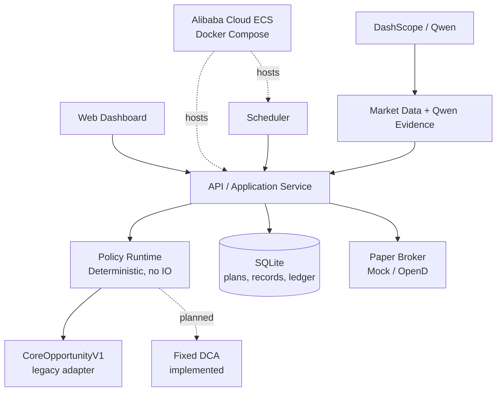

<p align="center">
  
</p>

<p align="center">
  <a href="./README.md">中文文档</a> | English
</p>

<p align="center">
  <a href="./LICENSE"></a>
  <a href="./CHANGE_LOG.md"></a>
  <a href="./STRATEGY_STUDIO_MIGRATION_PLAN.md"></a>
</p>

# IndexLink V2

IndexLink V2 is a **transparent, auditable, extensible quantitative DCA strategy studio and paper-trading execution platform** for long-term investors. It helps students and working professionals with limited budgets preserve a traceable answer to “why was this suggested, was it executed, and what actually happened?” rather than presenting opaque judgement as investment advice.

The current release is a demonstrable V2 MVP. It runs locally with SQLite or on Alibaba Cloud ECS, creates investment plans, configures and activates versioned policies, retrieves market inputs, produces bounded Qwen explanations, and lets a deployed AI profile produce a **read-only** DSL candidate; it then stores decision evidence, reads a paper account, and submits a paper order to MockBroker or a local Futu/Moomoo OpenD **paper account** only after an explicit operator request. Strategy Studio, the unified policy runtime, fixed-sample admission, and Web runtime-status hints are integrated; the system remains a single-user, paper-only demonstration.

> **No outperformance promise.** IndexLink does not predict markets, determine intrinsic value, or guarantee returns. Fixed DCA remains the required fair benchmark; every policy must be validated under matched cash flows, costs, data, and execution timing.

## Project Demo

Watch the current demo: [IndexLink V2 Demo on YouTube](https://www.youtube.com/watch?v=t8TCjlqE7D0).

The video shows a controlled local/paper-account flow. It is not investment advice, live-trading capability, or a return promise.

## Product Goal

The target is not one formula but a reproducible strategy lifecycle:

```text
Create Strategy → Validate → Backtest → Review → Save Version → Activate
→ Schedule → Evaluate → Paper Execute → Monitor → Audit
```

| Goal | Meaning |
| :--- | :--- |
| **Transparent** | Users can inspect the policy version, evidence, recommended amount, warnings, and order acknowledgement. |
| **Auditable** | Each decision retains input snapshots, policy reference, Qwen rationale, order data, and related fill observations. |
| **Reproducible** | The same policy version and complete context must produce the same recommendation; history and live use the same deterministic runtime. |
| **Extensible** | Built-in policies, fixed DCA, and later restricted DSL policies share one execution and audit boundary. |
| **Safe** | Paper trading only; the scheduler creates audit records but never submits orders; AI has no trading authority. |

See the [Strategy Studio Migration Plan](./STRATEGY_STUDIO_MIGRATION_PLAN.md) for the complete target design, compatibility rules, and PR sequence.

## Implementation and Policy Research

The current demo still includes the historical 70/20/10 decision path: fundamental/historical-position, trend, and bounded Qwen sentiment produce a recommendation and evidence. This is the candidate semantics of `CoreOpportunityV1`; it is **not** a proven claim of superior returns.

The repository keeps C1–C4, calibration fixtures, and reports as reproducible research assets. Under matched fixed-DCA historical samples, some candidates primarily changed cash utilisation, drawdown, or volatility and did not establish a stable return advantage. The legacy model is now retained as a versioned built-in policy, and `FixedDcaPolicy` is the new-plan default and fair benchmark. The restricted DSL has a deterministic, I/O-free interpreter shared by historical evaluation and live simulation; SQLite stores immutable versions, while Studio validates and saves them. A DSL version must pass fixed-fixture backtest, budget, and core-bucket safety gates before it can activate.

### Original 70/20/10 research: reproducible risk observations, not a return claim

The original `CoreOpportunityV1` combines 70% fundamentals, 20% trend, and 10% AI sentiment. Historical Qwen news judgements cannot be faithfully replayed, so the return/risk baseline below strictly uses the **90/10/0 AI-unavailable fallback** and calls the production domain functions directly. Frozen Qwen samples are used only for score/action-distribution sensitivity, never for return attribution.

The baseline uses versioned `calibration-v1` data, matched monthly USD 1,000 external cash flows, 5 bps buy cost, zero cash interest, and a no-look-ahead protocol; uninvested cash always remains in terminal wealth. SPY/QQQ are index proxies, not a complete total-return backtest of tradable ETFs.

| Index proxy | Fixed DCA: XIRR / terminal wealth | Original Core/Opportunity: XIRR / terminal wealth | Terminal difference vs DCA | Max drawdown (DCA → policy) | Annualised volatility (DCA → policy) | Cash utilisation (DCA → policy) |
| :--- | :--- | :--- | :--- | :--- | :--- |
| S&P 500 (SPY proxy) | 19.61% / $71,669 | 17.54% / $68,926 | -3.83% | 9.70% → 9.44% | 13.32% → 12.28% | 100.00% → 82.65% |
| NASDAQ Composite (QQQ proxy) | 16.88% / $815,385 | 15.84% / $740,761 | -9.15% | 33.03% → 31.29% | 16.83% → 15.71% | 100.00% → 83.31% |

Both samples do show lower observed maximum drawdown and annualised volatility, but alongside roughly 17% undeployed cash and lower terminal wealth. That **must not** be presented as unconditional “stability improvement” or policy superiority. V2's verifiable value is exposing the trade-off: policy version, `as_of`, sources, input snapshots, recommendation, budget constraints, order intent, and acknowledgement are traceable, reproducible, and reviewable.

See [Strategy Calibration Baseline V1](./STRATEGY_CALIBRATION_BASELINE_V1.md) for the full data protocol, score/action distributions, rolling out-of-sample windows, and frozen-Qwen sensitivity. See [C4 Research V1](./STRATEGY_C4_RESEARCH_V1.md) for C1–C4 research and why none was promoted as the default policy.

| Implementation | Detail and boundary |
| :--- | :--- |
| Plans, schedule rules, and local SQLite | Single-user local persistence; existing plans retain their established behaviour and compatible reads. |
| 70/20 inputs, AI Evidence, and Copilot Draft | Fundamental/trend inputs and bounded AI Evidence with a provider identity retain source and time semantics. Only `CoreOpportunityV1` maps its score into the legacy 10% input. A deployed profile can turn an operator objective into a read-only `StrategySpecDocument` candidate, but the API rebuilds domain validation; Fixed DCA/DSL are never rewritten by AI. Source failure explicitly degrades or rejects an automatic decision. |
| Decision evidence and history | Retains policy ID/version, generic recommendation, inputs, result, credential-free AI profile, rationale/news/warnings, and an optional order acknowledgement; legacy records remain readable. |
| Minimum scheduler | Creates idempotent evidence on due dates; **never auto-submits an order**. |
| Two-bucket budget, opportunity cash, and period constraints | Core/opportunity buckets are jointly constrained by the plan budget, available cash, cumulative period cap, and paper-only boundary. |
| Mock/OpenD paper trading | Connects to local-loopback OpenD paper accounts only; no live-trading capability exists. |
| Built-in policies and unified execution entry | New plans use `fixed_dca@1`; existing SQLite plans migrate to `core_opportunity_v1@1`; preview, scheduler, audit, and paper-only orders use the same resolver. |
| Immutable technical research fixture | `technical-v1` versions FRED S&P 500 / NASDAQ Composite daily closes as SPY / QQQ index proxies alongside raw Cboe VIX snapshots. Source, applicable-terms notice, date/gap rules, common coverage, and SHA-256 are verified. It reads compile-time embedded files only: no network, forward-fill, or interpolation; dated technical snapshots accept observations only when `timestamp <= as_of`. |
| Restricted DSL, deterministic runtime, Studio, and admission | Represents only allow-listed indicators, bounded expressions, and opportunity actions. Saving rebuilds domain invariants; activation compares a fixed-fixture backtest and checks budget/core-bucket safety. Close, SMA, EMA, RSI, drawdown, and VIX all use causal `technical-v1` evidence as of the decision date, with execution on the first later trading day. Admission compares matched cash flows, execution timing, and costs with Fixed DCA; it reports XIRR, terminal wealth, maximum drawdown, annualised volatility, Sortino, cash utilisation, and rolling windows. Outperformance is not an activation condition; insufficient warm-up or evidence rejects activation. |

## Architecture and Safety Boundaries

IndexLink uses **Hexagonal Architecture + Modular Monolith**. Domain policies remain pure functions; network, database, Qwen, market data, and brokers remain outside the adapter boundary.



Key constraints:

- **No I/O in policy runtime:** a policy receives resolved context only. It cannot query a database, call the network, read secrets, or place an order.
- **AI is bounded:** registered profiles produce explanations, warnings, and read-only restricted policy candidates only. A candidate must pass DSL validation, fixed-sample admission, and explicit user save/activation; it cannot bypass budget, operator confirmation, or paper-only restrictions.
- **Order safety:** only an explicit, due, validated paper-order request can be submitted. There is no live trading, automated cancellation, or scheduler auto-ordering.
- **Audit first:** retain inputs rather than conclusions only. New records retain policy ID, version, and a generic recommendation snapshot while old records remain readable.

## Current Workspace

```text
indexlink/
├─ crates/
│  ├─ core-domain/          # Amount, Action, Percentile and other invariant types
│  ├─ quant-engine/         # Current percentile, fundamental, and trend pure functions
│  ├─ decision-engine/      # Current 70/20/10 legacy decision implementation
│  ├─ investment-plans/     # Plans, schedules, two-bucket budget, execution preview
│  ├─ decision-records/     # Auditable decision-record port
│  ├─ market-data/          # Market-input providers
│  ├─ ai-client/            # DashScope/Qwen adapter and degradation
│  ├─ broker/               # Mock/OpenD paper-only adapters
│  ├─ storage/              # SQLite and persistence adapters
│  ├─ strategy-evaluation/  # Offline, versioned policy research
│  ├─ strategy-dsl/         # Restricted policy AST and pure validation
│  └─ api/                  # Axum HTTP and application orchestration
├─ apps/
│  ├─ server/               # Composition root and scheduler
│  └─ web/                  # Vite + React dashboard
├─ STRATEGY_STUDIO_MIGRATION_PLAN.md
└─ deployment/aliyun/       # ECS Docker Compose deployment scripts
```

> `strategy-policy`, two built-in policies, and the restricted Strategy DSL runtime are implemented. Arbitrary user scripts will never enter the runtime.

## Run Locally

1. Install stable Rust, `rustfmt`, `clippy`, and pnpm.
2. Create local configuration and start the server:

   ```bash
   cp .env.example .env
   cargo run -p indexlink-server
   ```

3. Check health:

   ```bash
   curl http://localhost:8080/health
   curl http://localhost:8080/ready
   ```

4. Start the web app:

   ```bash
   pnpm --dir apps/web install --frozen-lockfile
   pnpm --dir apps/web dev
   ```

The local `.env` is Git-ignored. `DASHSCOPE_API_KEY` is optional Qwen evidence configuration; `OPEND_PROVIDER`, `OPEND_HOST`, `OPEND_PORT`, and `OPEND_ACCOUNT_ID` are only for a local-loopback OpenD paper account. None may be committed or logged.

### Docker / Alibaba Cloud ECS

The project can run on Alibaba Cloud ECS with Docker Compose. SQLite is persisted in a local Docker volume:

```bash
docker compose -f deployment/docker-compose.yml up --build -d
docker compose -f deployment/docker-compose.yml ps
curl http://127.0.0.1:8080/ready
```

See [deployment/aliyun/README.md](./deployment/aliyun/README.md) for deployment instructions.

## Roadmap

1. **Policy contract and legacy wrapper:** completed: the generic `InvestmentPolicy` contract wraps legacy logic as `CoreOpportunityV1` and locks its behaviour with regression tests.
2. **Fixed DCA and unified resolver:** completed; fixed DCA and the legacy policy run through one preview, scheduler, audit, and paper-only flow.
3. **Policy-version and audit upgrade:** complete; new records retain the policy version and generic recommendation snapshot while legacy records remain readable.
4. **Restricted DSL/AST, validation, and deterministic runtime:** complete; it allows only allow-listed indicators, bounded expressions, and opportunity actions, rejecting arbitrary scripts, excessive condition trees, and fixed actions above budget. The first matching rule produces a generic recommendation from a complete snapshot.
5. **Unified historical evaluation:** complete; `strategy-evaluation` calls the same DSL interpreter with all allow-listed technical indicators limited to raw evidence available by the decision date and execution on the next trading day.
6. **Strategy storage, Studio, and admission:** complete; immutable SQLite version storage, controlled creation/validation, current-data simulation, and plan activation are available. A DSL version must compare XIRR, terminal wealth, drawdown, volatility, Sortino, cash utilisation, and rolling windows against Fixed DCA on a fixed fixture and pass evidence-integrity, budget, and core-bucket safety gates before activation; results are not return promises.
7. **Runtime observability and Web integration:** complete; the Web app uses `/health`, `/ready`, and `/runtime-status` to distinguish API, SQLite, Qwen, OpenD, and scheduler state, with React Query managing server-data caching.
8. **AI Evidence Registry and Copilot Draft:** complete for the credential-free Qwen profile registry, read-only DSL-draft endpoint, and Studio draft interaction: users can select only server-deployed profiles while keys remain in server environment or secret management. A candidate only populates an editable form and remains subject to deterministic validation, backtesting, explicit user save/activation, and review; it never receives order authority.

See [STRATEGY_STUDIO_MIGRATION_PLAN.md](./STRATEGY_STUDIO_MIGRATION_PLAN.md) for details.

## Disclaimer

> This project is for learning, technical research, and paper-trading demonstrations only. It is not investment advice.

- Every policy can lose money; historical results do not predict future returns.
- A policy without demonstrated, reproducible advantage must not be marketed as “improving returns” or “beating the market.”
- Users are responsible for understanding policy logic, data sources, delays, costs, taxes, regulatory obligations, and trading risk.
- No live-trading function is provided, and AI never receives order authority.

## Copyright and Contributors

Copyright © 2026 IndexLink Contributors. Released under the [MIT License](./LICENSE).

- [Jame (`jamesra26`)](https://github.com/jamesra26) — project initiator; architecture, 70/20/10 fundamental and trend-layer design, frontend implementation, PR review, and ongoing maintenance.
- [Xuanzhou Gu (`GuZZ1119`)](https://github.com/GuZZ1119) — independent V2 maintainer; backend and API, SQLite persistence, plan/two-bucket/scheduler flows, policy contracts and DSL Studio, evaluation and calibration, Qwen/OpenD paper-trading integration, Alibaba Cloud deployment, testing, documentation, and demo-loop implementation.
- [Yucong Peng (`YucongPeng`)](https://github.com/YucongPeng) — AI-layer design and implementation.
