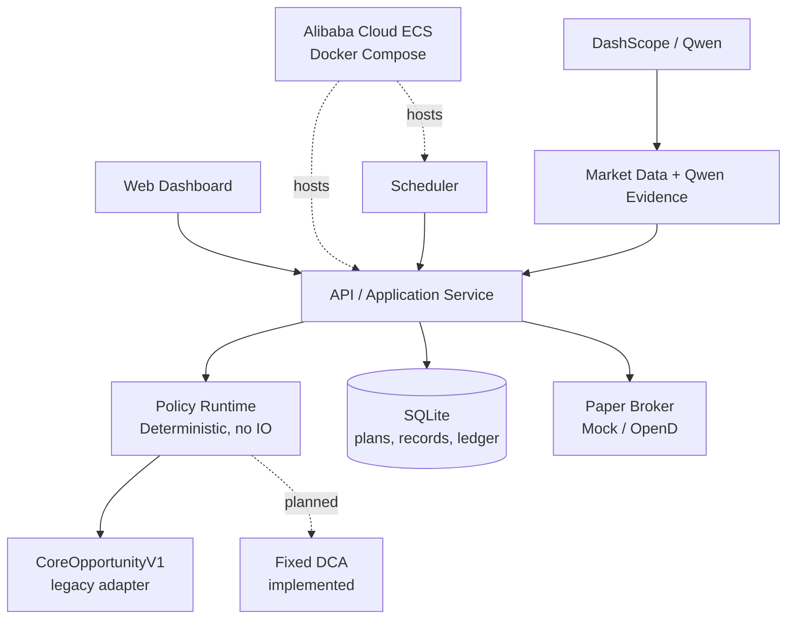

<p align="center">
  
</p>

<p align="center">
  中文文档 | <a href="./readme.en.md">English</a>
</p>

<p align="center">
  <a href="./LICENSE"></a>
  <a href="./CHANGE_LOG.md"></a>
  <a href="./STRATEGY_STUDIO_MIGRATION_PLAN.md"></a>
</p>

# IndexLink V2

IndexLink V2 是一个面向长期投资者的**透明、可审计、可扩展的量化定投策略工作台与 paper-trading 执行平台**。它帮助资金有限、希望长期坚持纪律的学生和上班族，把“计划为什么这样建议、是否执行、实际发生了什么”保留为可追溯记录，而不是把黑箱判断包装成投资建议。

当前版本为可演示的 V2 MVP：可在本地 SQLite 或 Alibaba Cloud ECS 上运行，创建定投计划、配置/激活版本化策略、拉取市场输入、获得受限 Qwen 解释，并由已部署 AI profile 生成**只读** DSL 候选草案；随后可生成决策存证、查看模拟账户，并在操作者明确确认后向 MockBroker 或本机 Futu/Moomoo OpenD **模拟账户**提交 paper order。策略 Studio、统一策略运行时、固定样本准入和 Web 运行状态提示均已接入；系统仍只支持单用户、paper-only 演示。

> **不承诺跑赢。** IndexLink 不预测市场，不判断“真实价值”，不保证收益。固定 DCA 是必须保留的公平基准；任何策略都必须在匹配的资金流、成本、数据和执行时点下接受验证。

## 项目演示

观看当前版本的演示视频：[IndexLink V2 Demo（YouTube）](https://www.youtube.com/watch?v=t8TCjlqE7D0)。

视频展示的是受控的本地/模拟账户演示链路，不代表真实投资建议、实盘下单能力或收益承诺。

## 产品目标

目标体验不是单一公式，而是一个可复现的策略生命周期：

```text
创建策略 → 验证 → 回测 → 审阅 → 保存版本 → 激活 → 调度
→ 评估 → Paper 执行 → 监控 → 审计
```

| 目标 | 含义 |
| :--- | :--- |
| **透明** | 使用者能看到策略版本、输入证据、推荐金额、风险提示和订单回执。 |
| **可审计** | 每次决策保存输入快照、策略引用、Qwen 理由、订单和成交相关记录。 |
| **可复现** | 相同策略版本与完整上下文必须得到相同推荐；历史与实时使用同一确定性运行时。 |
| **可扩展** | 内置策略、固定 DCA 和后续受限 DSL 策略共享同一执行与审计边界。 |
| **安全** | 仅支持 paper trading；scheduler 只生成审计，不能自动下单；AI 不拥有交易授权。 |

完整迁移设计、兼容策略和 PR 拆分见 [策略工作台迁移计划](./STRATEGY_STUDIO_MIGRATION_PLAN.md)。

## 实现与策略研究

当前生产演示仍包含历史的 70/20/10 决策路径：基本面/历史位置、趋势和受限 Qwen 情绪用于生成建议及证据。这是现有的 `CoreOpportunityV1` 候选语义，**不是经证明能提高收益的默认承诺**。

仓库保留 C1–C4、校准夹具和报告，以记录真实的研究结果与失败候选：在匹配固定 DCA 的历史样本中，部分候选主要改变现金使用率、回撤或波动，并未稳定形成收益优势。旧模型现已作为版本化内置策略保留，`FixedDcaPolicy` 已成为新计划默认值和公平对照基准。受限 DSL 已具备确定性、无 IO 的解释器，并由历史评估器直接调用；SQLite 保存不可变 DSL 版本，Strategy Studio 已支持校验、保存、复制、当前数据模拟、固定样本准入和计划激活。激活后的策略版本由 Decision Preview、scheduler、审计与 paper-only 执行共用同一 resolver。

### 原始 70/20/10 研究：可复现风险观察，而非收益承诺

原始 `CoreOpportunityV1` 以 70% 基本面、20% 趋势、10% AI 情绪形成建议；但历史上没有可信可回放的 Qwen 新闻判断。因此下表的收益/风险基线严格使用 **90/10/0 的 AI 不可用降级线**，并直接调用生产领域函数。冻结 Qwen 样本只用于分数与动作分布敏感性，不计入收益结论。

基线使用版本化 `calibration-v1` 数据、月度相同 USD 1,000 外部现金流、5 bps 买入成本、零现金利息与无未来函数口径；未投入现金始终计入期末净值。SPY/QQQ 是指数代理，不是可交易 ETF 的完整复权回测。

| 指数代理 | 固定 DCA：XIRR / 期末净值 | 原始核心+机会：XIRR / 期末净值 | 相对 DCA 期末差 | 最大回撤（DCA → 原策略） | 年化波动（DCA → 原策略） | 现金使用率（DCA → 原策略） |
| :--- | :--- | :--- | :--- | :--- | :--- | :--- |
| S&P 500（SPY 代理） | 19.61% / $71,669 | 17.54% / $68,926 | -3.83% | 9.70% → 9.44% | 13.32% → 12.28% | 100.00% → 82.65% |
| NASDAQ Composite（QQQ 代理） | 16.88% / $815,385 | 15.84% / $740,761 | -9.15% | 33.03% → 31.29% | 16.83% → 15.71% | 100.00% → 83.31% |

两组样本确实观察到较低的最大回撤和年化波动，但它们同时伴随约 17% 的未部署现金与更低期末净值；这**不能**被表述为无条件的“稳定性提升”或策略优势。V2 的可验证价值是把该取舍完整暴露出来：策略版本、`as_of`、数据来源、输入快照、推荐、预算约束、订单意图与回执都可追溯、复跑和审查。

完整数据口径、分数/动作分布、滚动样本外窗口与冻结 Qwen 敏感性见 [策略校准基线 V1](./STRATEGY_CALIBRATION_BASELINE_V1.md)；C1–C4 研究及其未升级为默认策略的理由见 [C4 研究 V1](./STRATEGY_C4_RESEARCH_V1.md)。

| 实现 | 细节与边界 |
| :--- | :--- |
| 计划管理、周期规则与本地 SQLite | 单用户本地持久化；已有计划保持既有行为与兼容读取。 |
| 70/20 市场输入、AI Evidence 与 Copilot Draft | 基本面/趋势输入与带 Provider 身份的受限 AI Evidence 均保留来源和时间语义；仅 `CoreOpportunityV1` 将分数兼容映射为旧 10% 输入。已部署 profile 可将用户目标转换为只读 `StrategySpecDocument` 草案，但 API 会重做领域校验；Fixed DCA/DSL 不受 AI 改写，外部源失败时明确降级或拒绝自动决策。 |
| 决策存证与历史查询 | 记录策略 ID/版本、通用推荐、输入、结果、无密钥 AI profile、理由/新闻/警告及可选订单回执；旧记录保持可读。 |
| 最小 scheduler | 到期时幂等生成存证；**从不自动下单**。 |
| 双桶预算、机会现金与周期约束 | 核心/机会桶受计划预算、可用现金、周期累计上限与 paper-only 边界共同约束。 |
| Mock/OpenD paper trading | 仅连接 loopback OpenD 模拟账户；没有实盘交易能力。 |
| 内置策略与统一执行入口 | 新计划使用 `fixed_dca@1`；既有 SQLite 计划迁移为 `core_opportunity_v1@1`；预览、scheduler、审计和 paper-only 订单使用同一 resolver。 |
| 不可变技术研究夹具 | `technical-v1` 将 FRED S&P 500 / NASDAQ Composite 日线作为 SPY / QQQ 指数代理，并与 Cboe VIX 原始快照分开版本化；来源、适用条款说明、日期/缺失值规则、共同覆盖范围和 SHA-256 均被校验。它只读编译期嵌入文件，不联网、不前填、不插值；带日期的技术快照只接受 `timestamp <= as_of` 的观察。 |
| 受限 DSL、确定性 runtime、Studio 与准入 | 仅表达白名单指标、有限表达式和机会桶动作；保存时重建领域不变量，激活前比较固定样本回测并检查预算/核心桶安全。Close、SMA、EMA、RSI、回撤和 VIX 均从 `technical-v1` 的截止日因果证据生成；历史成交固定为决策日后的首个交易日。准入以同一现金流、成交时点和成本对照 Fixed DCA，展示 XIRR、期末净值、最大回撤、年化波动、Sortino、现金使用率与滚动窗口；跑赢不是激活条件，预热/证据不足时拒绝激活。 |

### 使用 Strategy Studio 与受限 Copilot

1. 在“定投标的”创建计划；新计划默认绑定 `fixed_dca@1`，不会因 AI 或市场信号而改写核心预算。
2. 打开“策略 Studio”，先选择服务器实际部署、且具备 `restricted_policy_drafts` 能力的 AI Profile，再用自然语言说明希望约束的**机会桶**行为。
3. Copilot 只会把规范化 DSL 草案回填为可编辑表单，同时显示 provider、简短解释、风险提示与服务端提供的可信引用；它不会保存、回测、激活、绑定计划或下单。
4. 使用者审阅并编辑白名单指标、条件和机会桶动作后，手动“验证并保存不可变版本”。任意脚本、用户代码、核心桶否决和未被白名单允许的动作均会被拒绝。
5. 对保存版本运行固定样本准入。页面会如实展示与 Fixed DCA 的 XIRR、期末净值、最大回撤、波动、Sortino、现金使用率和滚动窗口；这不是收益预测。
6. 仅当准入通过后，使用者才能显式将该版本绑定到计划。后续 Decision Preview、scheduler 和审计才使用同一版本；审批模式仍要对已保存的决策记录单独确认 paper order。

若没有配置 `DASHSCOPE_API_KEY` 或其他服务器部署的兼容 Provider，Profile 列表为空，Studio 会禁用草案生成；手工 DSL 编辑、校验和固定样本准入不依赖 AI Key。Key 仅可存放在服务端环境变量或 secret manager，绝不可提交到仓库、浏览器或决策存证中。

## 架构与安全边界

IndexLink 采用 **Hexagonal Architecture + Modular Monolith**。领域策略保持纯函数；网络、数据库、Qwen、市场数据和 Broker 均在适配器边界之外。



关键约束：

- **策略运行时无 IO**：策略只接收已解析的上下文，不能直接读数据库、调用网络、读取密钥或下单。
- **AI 受限**：已部署 Provider 仅输出解释、风险提示与只读候选草案；草案必须经 DSL 校验、固定样本准入和用户显式保存/激活，不能越过预算、人工确认或 paper-only 限制。
- **订单安全**：只有操作者显式请求的、到期且已验证的 paper order 才能提交；不支持实盘、自动撤单或 scheduler 自动下单。
- **审计优先**：记录输入而非只记录结论；新记录保存策略 ID、版本与通用推荐快照，旧记录保持可读。

## 当前 Workspace

```text
indexlink/
├─ crates/
│  ├─ core-domain/          # 金额、动作、Percentile 等带不变量领域类型
│  ├─ quant-engine/         # 当前分位、基本面与趋势纯函数
│  ├─ decision-engine/      # 当前 70/20/10 legacy 决策实现
│  ├─ investment-plans/     # 计划、周期、双桶预算与执行预览
│  ├─ decision-records/     # 决策存证领域 port
│  ├─ market-data/          # 市场输入 provider
│  ├─ ai-client/            # DashScope/Qwen 适配与降级
│  ├─ broker/               # Mock/OpenD paper-only adapter
│  ├─ storage/              # SQLite 与持久化 adapter
│  ├─ strategy-evaluation/  # 离线、版本化策略研究
│  ├─ strategy-dsl/         # 受限策略 AST 与纯函数校验
│  └─ api/                  # Axum HTTP 与应用编排
├─ apps/
│  ├─ server/               # 组合根与 scheduler
│  └─ web/                  # Vite + React Dashboard
├─ STRATEGY_STUDIO_MIGRATION_PLAN.md
└─ deployment/aliyun/       # ECS Docker Compose 部署脚本
```

> 已实现 `strategy-policy`（策略契约）、两个内置策略和受限 Strategy DSL runtime；后续不会将任意用户脚本加入运行时。

## 本地运行

1. 安装 stable Rust、`rustfmt`、`clippy` 和 pnpm。
2. 创建本地配置并启动服务：

   ```bash
   cp .env.example .env
   cargo run -p indexlink-server
   ```

3. 检查健康状态：

   ```bash
   curl http://localhost:8080/health
   curl http://localhost:8080/ready
   ```

4. 启动 Web：

   ```bash
   pnpm --dir apps/web install --frozen-lockfile
   pnpm --dir apps/web dev
   ```

本地 `.env` 已被 Git 忽略。可选的 `DASHSCOPE_API_KEY` 只用于 Qwen 证据；也可在 `AI_PROVIDER_PROFILES` 中声明多个已部署的 OpenAI-compatible profile（清单只引用 `api_key_env` 环境变量名，必须恰有一个 `default`，远程 endpoint 必须 HTTPS）。用户和浏览器只能从已部署 profile 中选择，永远看不到 Key 或 endpoint。`OPEND_PROVIDER`、`OPEND_HOST`、`OPEND_PORT` 与 `OPEND_ACCOUNT_ID` 只用于本机 loopback OpenD 模拟账户，均不得提交或写入日志。

启动后在浏览器访问 Vite 输出的本地地址（通常为 `http://localhost:5173`）。如需使用受限 Copilot，先确认状态栏显示“AI 已配置”；没有配置时其余 Studio 流程仍可正常使用。

### Docker / Alibaba Cloud ECS

项目可用 Docker Compose 在 Alibaba Cloud ECS 运行；SQLite 由本地 Docker volume 持久化：

```bash
docker compose -f deployment/docker-compose.yml up --build -d
docker compose -f deployment/docker-compose.yml ps
curl http://127.0.0.1:8080/ready
```

部署说明见 [deployment/aliyun/README.md](./deployment/aliyun/README.md)。

## 路线图

1. **策略契约与兼容包装**：已增加通用 `InvestmentPolicy` 契约，用 `CoreOpportunityV1` 包装旧逻辑并锁定回归。
2. **固定 DCA 与统一解析入口**：已完成；固定 DCA 与旧策略通过同一预览、scheduler、审计和 paper-only 流程运行。
3. **策略版本与审计升级**：已完成；新记录保存策略版本和通用推荐快照，旧记录保持可读。
4. **受限 DSL/AST、校验与确定性 runtime**：已完成；仅允许白名单指标、有限表达式与机会桶动作，拒绝任意脚本、超深条件树和超预算固定金额；首条命中规则会在完整快照上生成通用推荐。
5. **统一历史评估**：已完成；`strategy-evaluation` 直接调用同一 DSL 解释器，全部白名单技术指标仅使用决策日及此前原始证据，并固定在下一交易日成交。
6. **策略存储、Studio 与准入**：已完成不可变版本存储、受控创建/验证、当前数据模拟和计划激活。DSL 版本激活前必须在固定样本中与 Fixed DCA 对照 XIRR、期末净值、回撤、波动、Sortino、现金使用率和滚动窗口，并通过证据完整性、预算/核心桶安全门槛；结果不构成收益承诺。
7. **运行可观测性与前端联调**：已完成；Web 通过 `/health`、`/ready`、`/runtime-status` 区分 API、SQLite、Qwen、OpenD 与 scheduler 状态，并使用 React Query 管理服务端数据缓存。
8. **AI Evidence Registry 与 Copilot Draft**：已完成多 Profile 的 OpenAI-compatible 无密钥 Registry、只读 DSL 草案接口与 Studio 草案交互；Qwen 是默认样本，用户只能选择服务器已部署的 profile，密钥仅留在服务端环境或 secret manager。草案只会回填可编辑表单，仍须经确定性校验、回测、人工保存与激活，且永不获得下单权限。

详见 [STRATEGY_STUDIO_MIGRATION_PLAN.md](./STRATEGY_STUDIO_MIGRATION_PLAN.md)。

## 免责声明

> 本项目仅供学习、技术研究和 paper-trading 演示，不构成投资建议。

- 所有策略输出都可能亏损，历史结果不预测未来收益。
- 未证明稳定优势的策略不得被描述为“提高收益”或“跑赢市场”。
- 使用者应自行理解策略、数据来源、延迟、成本、税费、合规义务与交易风险。
- 当前不提供实盘交易功能；在任何情况下，AI 都不拥有下单权限。

## 版权与贡献者

Copyright © 2026 IndexLink Contributors。项目以 [MIT License](./LICENSE) 发布。

- [Jame (`jamesra26`)](https://github.com/jamesra26) — 项目发起者；架构设计、70/20/10 基本面与趋势层设计、前端实现、PR 审阅与持续维护。
- [Xuanzhou Gu (`GuZZ1119`)](https://github.com/GuZZ1119) — V2 独立项目维护者；后端与 API、SQLite 持久化、计划/双桶/调度闭环、策略契约与 DSL Studio、回测与校准、Qwen/OpenD paper-trading 集成、阿里云部署、测试、文档与演示闭环实现。
- [Yucong Peng (`YucongPeng`)](https://github.com/YucongPeng) — AI 层设计与实现。
