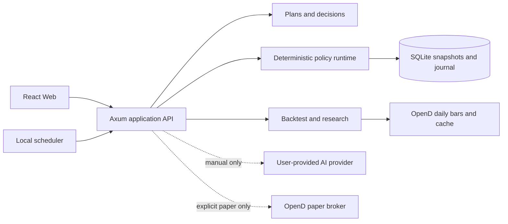

<p align="center">
  
</p>

<p align="center">
  <strong>把长期投资方法变成看得懂、能回测、可复查的个人计划。</strong>
</p>

<p align="center">
  Rust 本地服务 · React 用户界面 · SQLite 审计存储 · OpenD 真实日线 · 用户自带 AI
</p>

<p align="center">
  中文文档 · <a href="./readme.en.md">English</a>
</p>

<p align="center">
  <a href="./LICENSE"></a>
  <a href="./CHANGE_LOG.md"></a>
  <a href="./SECURITY.md"></a>
</p>

# IndexLink V2.1

IndexLink 是一个面向普通长期投资者的**本地策略计划与研究工具**。它把一条投资方法拆成可解释的规则、真实历史回测、定期建议和不可覆盖的执行记录，让用户能回答四个问题：

1. 这条策略在做什么；
2. 在同一只标的、同一段时间和同一资金节奏下，它与其他策略有什么区别；
3. 这期为什么建议投入、减量或等待；
4. 我最终是否执行，历史记录能否复查。

V2.1 是**单用户、本地优先、人工执行**版本。它不会代替用户下单，不承诺收益，也不把 AI 变成交易决策者。

> **风险声明：** 本项目仅供学习、策略研究和 paper-trading 演示，不构成投资建议。历史回测不预测未来；数据错误、市场制度变化、税费、滑点和流动性都可能改变结果。

## 技术制作

IndexLink 不是一组静态页面，也不是把策略判断交给大模型的聊天壳。它是一套在本机运行、由确定性 Rust 规则负责计算、由 React 负责解释与操作的完整应用。

| 层次 | 技术与职责 |
| --- | --- |
| 服务端 | Rust 2021、Axum 与 Tokio；负责策略不变量、计划调度、回测、AI/OpenD 适配和 HTTP 契约 |
| 领域与研究 | Rust workspace 模块化单体；受限 Formula AST、因果指标、统一资金账本、不可变策略版本和可复现研究夹具 |
| 本地数据 | SQLx + SQLite；保存计划、建议输入快照、个人策略和 append-only 手工执行记录 |
| Web | React 19、TypeScript、Vite 8、Tailwind CSS v4、TanStack Query 与 Valtio；服务端状态和临时界面状态分离 |
| 图表 | Apache ECharts 用于可缩放净值、价格与执行轨道；Recharts 用于轻量结果展示 |
| 外部适配 | Futu/Moomoo OpenD 提供本机只读日线；QwenCloud、百炼、GPT、Claude、DeepSeek 仅在用户手动触发时调用 |
| 质量门禁 | Rustfmt、Clippy、Cargo workspace tests、ESLint、TypeScript build 与 Vitest；前端覆盖率门槛 90% |

架构采用 **Hexagonal Architecture（Ports & Adapters）+ Rust modular monolith**：核心规则不依赖浏览器、数据库、行情源或模型供应商，外部能力可以替换，输入与结论均能留下可审计证据。

## 当前已经能做什么

| 模块 | 当前能力 | 明确边界 |
| --- | --- | --- |
| 个人中心 | 读取真实计划、本期建议、下次评估日和 append-only 执行历史；手动记录“已执行”或“跳过” | 不自动下单；同一到期建议只能形成一条最终确认 |
| 我的计划 | 创建、暂停、继续和删除长期计划；冻结策略版本、标的、预算与评估节奏 | Fixed DCA 不依赖行情；公式策略创建前必须通过历史数据预检 |
| 策略中心 | 1 个 Fixed DCA 基准、20 个规则家族 × 5 组不可变参数，共 101 个官方版本；个人版本单独标注 | “可建立”不代表适合任何资产，也不代表未来有效 |
| 策略工坊 | 用白名单指标、观察窗口、比较符、阈值和机会额度建立个人规则；保存不可变版本 | 不接受任意代码；最多三条优先规则、每条三个条件；核心投入不能被取消 |
| 策略分析 | 对 US/HK/SH/SZ 的自选标的运行真实日线回测；支持 1m/3m/6m/1y/3y/5y/all；展示净值、买点、资金账本和风险指标 | 所有策略使用同一标的、日期、现金流与成本口径；缺少真实数据时明确失败，不生成演示曲线 |
| 高级实验室 | 临时连接本机 Futu/Moomoo OpenD；临时输入 QwenCloud、百炼、GPT、Claude 或 DeepSeek Key | 凭据只留在当前 Rust 进程内存，重启即失效；OpenD 页面配置只授予只读行情能力 |
| 可选 AI | 手动执行“自然语言 → 受限草案”“真实回测 → 普通解释”“近期计划摘要” | 不参与回测计算，不保存/激活策略，不生成订单，不自动运行 |

## 一条完整的本地闭环

```text
策略中心 / 策略工坊
        ↓ 选择不可变策略版本
真实标的回测与数据预检
        ↓
建立个人计划
        ↓ 到期时由调度器幂等生成建议
查看建议与依据
        ↓ 用户在自己的券商操作
手工确认“已执行 / 跳过”
        ↓
执行历史与输入快照永久追加、不可覆盖
```

系统中的“执行”默认是**用户报告的事实记录**。可选 OpenD paper broker 仅用于本机模拟账户实验；scheduler 和 AI 都没有自动提交订单的权限。

## 策略模型

V2.1 的公共策略不是 100 份互不兼容的脚本，而是同一个受限公式框架下的不可变版本：

```text
历史日线 → 因果指标（只读取观察日及以前数据）
         → 按优先级检查规则
         → 调整本期“机会额度”
         → 核心投入保持不变
```

当前白名单覆盖价格/指数均线、双均线、三均线、RSI、历史价格分位、波动率、波动率扩张、回撤、接近高点、趋势与波动组合、动量与波动组合、趋势与回撤组合、趋势与动量组合等家族。公式定义、参数和来源随策略版本一起冻结；第一个命中的规则停止后续判断。

Fixed DCA 始终保留为基准。旧“70/20/10 自适应”研究没有进入普通用户目录；其历史实验与未形成稳定收益优势的结论仍保留在 [研究文档](./docs/README.md)，避免把失败结果从项目历史中抹去。

### 回测口径

- 真实日线来自当前配置的只读 provider；普通运行时目前接入本机 OpenD，并使用 SQLite 缓存命中。
- 相同对比中的策略共享标的、起止日期、投入预算、交易日映射和成本模型。
- 净值指数以共同起点 `100` 归一化，只比较资金路径变化，不代表股价或账户余额。
- 专业视角提供区间收益、年化收益、XIRR、最大回撤、年化波动、Sortino、现金使用率、交易成本、峰值/低点/恢复日以及公式代入值。
- 指标预热不足、行情授权不足、数据过期或 provider 不可用时返回明确错误；不会用静态收益率或随机曲线补位。

## 本地启动

### 依赖

- Rust stable（包含 `cargo`、`rustfmt`、`clippy`）
- Node.js 与 pnpm
- 可选：本机 Futu/Moomoo OpenD，用于 US/HK/SH/SZ 真实日线与模拟账户实验

### 1. 启动后端

```bash
git clone https://github.com/GuZZ1119/indexlinkV2.git
cd indexlinkV2
cp .env.example .env
cargo run -p indexlink-server
```

默认监听 `127.0.0.1:8080`。检查服务：

```bash
curl http://127.0.0.1:8080/health
curl http://127.0.0.1:8080/ready
```

### 2. 启动前端

```bash
pnpm --dir apps/web install --frozen-lockfile
pnpm --dir apps/web dev
```

浏览器打开 Vite 输出的本地地址，通常是 `http://127.0.0.1:5173`。

### 3. 可选：接入 OpenD

先启动并登录 Futu/Moomoo OpenD，再在“高级实验室”输入回环地址；也可在本机 `.env` 中配置：

```dotenv
OPEND_PROVIDER=moomoo
OPEND_HOST=127.0.0.1
OPEND_PORT=11111
OPEND_MARKET_DATA_ENABLED=true
OPEND_PAPER_BROKER_ENABLED=false
```

没有 OpenD 时，计划管理、Fixed DCA、执行日志和已缓存研究仍可使用；新的任意标的真实回测与需要行情的公式策略会明确提示数据不可用。

### 4. 可选：接入自己的 AI

在“高级实验室”选择供应商、模型并输入 Key，然后点击“验证 AI 可用性”。Key 只发送到当前本机后端进程，不写入浏览器存储、SQLite、`.env` 或日志。保存连接本身不会调用模型；所有 AI 功能仍需用户逐次点击。

### 5. 可选：本地 Docker

```bash
docker compose -f deployment/docker-compose.yml up --build
```

Compose 只把服务发布到宿主机 `127.0.0.1`。本仓库不再提供云服务器一键部署脚本；若自行反向代理或开放端口，必须先增加认证、TLS、限流和 CSRF/Origin 防护。

## 安全模型

- 后端和 Docker 默认只监听/发布到 loopback；当前 API **没有账户认证**，不得直接暴露到局域网或公网。
- HTTP 请求体和 RSS 响应体均有 1 MiB 上限；模型解析错误不记录原始输出。
- AI endpoint 由服务端供应商配置固定，远程地址要求 HTTPS；API Key 不回显。
- OpenD host 必须是回环地址，页面会话配置不会自动开启 paper broker。
- 领域 newtype、受限 DSL、策略版本和执行 journal 在服务端重新校验；前端输入不是安全边界。
- SQL 写入使用参数绑定；策略 runtime 不执行用户脚本，也不直接访问网络、数据库或 broker。

完整威胁模型、仍未解决的依赖告警和公开披露方式见 [SECURITY.md](./SECURITY.md)；本次收口审查见 [V2.1 代码审查](./docs/reviews/v2_1_code_audit_2026-09-23.md)。

## 架构

IndexLink 使用 **Hexagonal Architecture（Ports & Adapters）+ Rust modular monolith**。领域规则位于内部，SQLite、OpenD、AI、HTTP 与 Web 都是可替换适配器。



主要目录：

```text
apps/server                 Rust 组合根、本地 scheduler
apps/web                    Vite + React + Tailwind 前端
crates/core-domain          带不变量的领域类型
crates/investment-plans     计划、周期和预算规则
crates/strategy-policy      统一策略契约
crates/strategy-dsl         受限公式 AST、校验与解释器
crates/builtin-policies     Fixed DCA 与兼容策略
crates/strategy-evaluation  回测、指标、研究夹具
crates/market-data          OpenD/Alpaca 只读数据适配器与缓存契约
crates/ai-client            多供应商 AI 协议与有界输出
crates/broker               Mock/OpenD paper-only 适配器
crates/storage              SQLite 审计存储
crates/api                  HTTP 契约与应用编排
docs                        API、计划、审查与策略研究
```

公开 API 契约见 [API 管理手册](./docs/reference/api-management.md)，前端边界见 [Web Plan](./apps/web/PLAN.md)，完整文档见 [docs/README.md](./docs/README.md)。

## 验证

```bash
cargo fmt --all -- --check
cargo clippy --workspace --all-targets -- -D warnings
cargo test --workspace
pnpm --dir apps/web lint
pnpm --dir apps/web test:coverage
pnpm --dir apps/web build
```

行为变更需要聚焦测试，并在 [CHANGE_LOG.md](./CHANGE_LOG.md) 记录涉及文件、验证结果和模型。前端覆盖率门槛为 90%。

## 开源来源与引用

本项目没有把 QuantConnect LEAN、TA-Lib 或论文中的交易代码直接复制进 runtime；它们用于指标语义、回测边界和策略研究的交叉核对。公式实现、因果性约束、预算模型与审计契约均在本仓库独立实现并测试。

- 架构：Alistair Cockburn 的 [Hexagonal Architecture](https://alistair.cockburn.us/hexagonal-architecture)。
- 回测与研究参考：[QuantConnect LEAN](https://github.com/QuantConnect/Lean)（Apache-2.0）、[TA-Lib](https://ta-lib.github.io/)（BSD）、Meb Faber 的 [A Quantitative Approach to Tactical Asset Allocation](https://papers.ssrn.com/sol3/papers.cfm?abstract_id=962461)。
- UI 与图表：[shadcn/ui](https://github.com/shadcn-ui/ui)（MIT，组件模式与少量 Tailwind variant）、[Recharts](https://recharts.github.io/)（MIT）、[Apache ECharts](https://echarts.apache.org/)（Apache-2.0）、[TanStack Query](https://github.com/TanStack/query)（MIT）。
- 行情接口：Futu 官方 [OpenD / OpenAPI 文档](https://openapi.futunn.com/futu-api-doc/en/intro/intro.html)。
- 研究数据：FRED 与 Cboe 原始来源及校验值记录在 `crates/strategy-evaluation/data/generated/*.manifest.json`；使用者仍须遵守各数据提供方条款。

逐项用途、许可证和“参考而非复制”的边界见 [THIRD_PARTY_NOTICES.md](./THIRD_PARTY_NOTICES.md)。

## 项目状态与不做事项

V2.1 的目标是把本地闭环做完整，不继续扩大成券商托管平台。以下内容不在当前承诺中：

- 多用户账户、云端同步和公网服务；
- 自动实盘、托管资金、自动撤单和收益保证；
- 分钟级/高频策略、任意 Python/JavaScript 策略；
- 社交发布、跟单、策略市场和跨用户排行榜；
- 把 AI 新闻情绪自动注入普通策略。

下一阶段优先项是数据许可复核、依赖审计余项、交易日历，以及把“资金周期”和“策略观察频率”拆成两个独立契约。

## License

Copyright © 2026 IndexLink Contributors。项目代码以 [MIT License](./LICENSE) 发布。第三方库、研究数据和外部服务分别受其原始许可证与使用条款约束。
